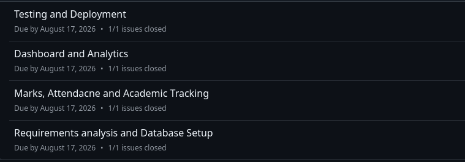
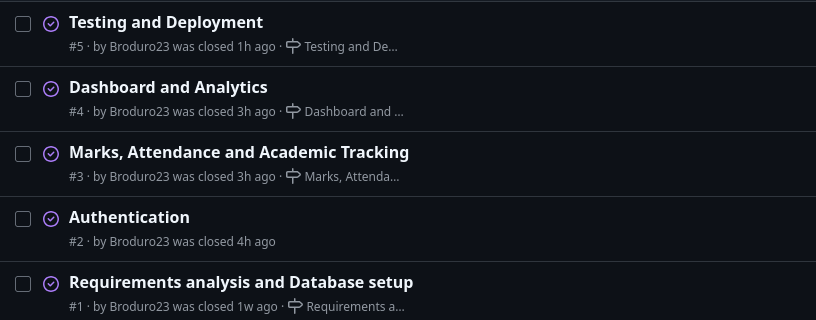
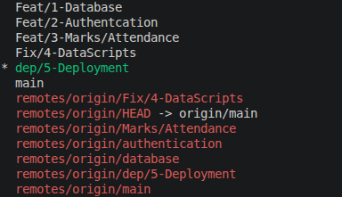
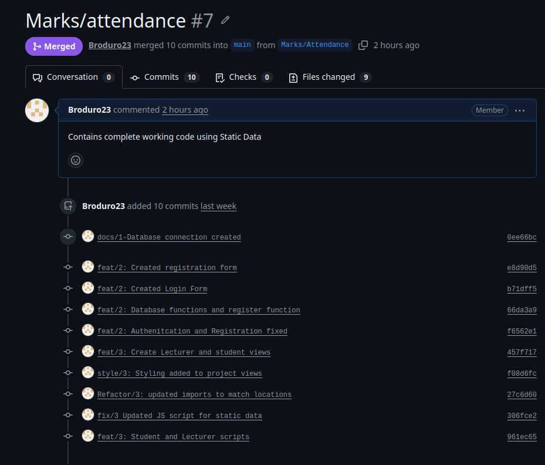
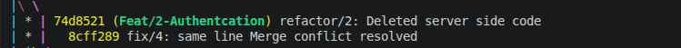

# Project Submission Report

## 1. Student Details

- **Full Name:** [Bravin Oduor]
- **GitHub Username:** [Broduro23]
- **Email:** [joseph.bravin@strathmore.edu]

---

## 2. Deployed Project Link

- **Live GitHub Pages URL:** [https://is-project-2026.github.io/academic-tracking-dashboard-154876/]
  *(Example: https://is-project-2026.github.io/hospital-management-138141/)*

---

## 3. Reflection — Grounded in Your Git History

> **Rules:** Every answer below **must include a direct link** to the specific commit, PR, issue, or branch in your repository that demonstrates what you are describing. Answers without working links will not be graded. Generic explanations that could apply to any project will receive zero marks.
>
> **Marks:** A (2 marks) · B (1 mark) · C (1 mark) · D (1 mark) = **5 marks total**

### A. Your Best Commit

Paste the URL of the commit in your history that you think best demonstrates clean conventional commit practice (good type tag, clear subject, meaningful body or footer).

- **Commit URL:** [https://github.com/IS-PROJECT-2026/academic-tracking-dashboard-154876/commit/1c8d984a667f75e1b09801d4e2d2242126a49997]
- **Why this one?** [1: Its uses an appropriate naming convention ie  fix/
                    2: It's body delivers a clear and concise message to issue being addressed]

### B. A Mistake or Struggle

Link to a commit, PR, or issue where something went wrong — a bad commit message you had to fix, a branch you had to delete and recreate, a PR that needed rework, or a deployment that broke. 

- **Link to the evidence:** [https://github.com/IS-PROJECT-2026/academic-tracking-dashboard-154876/commit/329c07c203bfd771c5d0a2c7c163a50c41c8933c]
- **What happened and how did you recover?** [First deployment of the project to the web broke and hence I was getting error 404 when initially loading the pages. Recovery was through moving the index.html file from the views subfolder to the project root folder]

### C. A Pull Request You're Proud Of

Paste the URL of the PR that best shows your self-review process — one where the description is clear, the issue linkage is correct, and the diff tells a coherent story.

- **PR URL:** [https://github.com/IS-PROJECT-2026/academic-tracking-dashboard-154876/pull/10]
- **What did you check before merging?** [Checked if the imports after changing the location of the index.html file were aligned for seamless rendering of the pages]

### D. One Thing You Would Do Differently

If you had to restart this project from scratch with everything you know now, name one specific workflow decision you would change (not a code change — a Git/project management decision).

- **What would you change?** [1: I would use clearer naming conventions for my branches
                                2: Carry out small changes on each github branch]
- **Link to the evidence of the original decision:** [change this branch name, https://github.com/IS-PROJECT-2026/academic-tracking-dashboard-154876/tree/dpe/6--Deployment-v2]

---

## 4. Screenshots of Key GitHub Features

Demonstrate your workflow mechanics by embedding your screenshots below.

> **CRITICAL FOR WORKING IMAGES:** Do not type manual folder paths. Edit this file directly on the GitHub web interface, click on the blank line below each prompt, and **paste (Ctrl+V / Cmd+V)** your screenshot. GitHub will automatically upload the file and generate a permanent, working image link for you.

### A. Milestones and Issues
*Provide a screenshot showing your active milestone(s) and the granular tracking issues linked directly to them.*

[ ]

* **Caption:** [These milestones track what the project wants to achieve from requirements planning to marks/attendance tracking to deployment.]

### B. Project Board
*Provide a screenshot of your GitHub Project Board with your issues organized dynamically across columns (To Do, In Progress, Done).*

[]

* **Caption:** [it outlines the issues are mostly placed in done state since they are mostly completed]

### C. Branching Architecture
*Provide a screenshot showing your local or remote Git branch list, highlighting your use of conventional, issue-linked naming patterns (e.g., `feat/`, `fix/`, `style/`).*

[]

* **Caption:** [Branching was done inline with the features that would be included in the project and a separate branch to handle deployment]

### D. Pull Requests & Traceability
*Provide a screenshot of a completed or open Pull Request (PR) on GitHub that clearly shows it is linked to a related development issue.*

[]

* **Caption:** [PR includes commits for Marks and grades tracking closing issue 3]

---

## 5. Merge Conflict Evidence

You must engineer **three merge conflicts**, each triggered by a **different cause** from those covered in the lecture. For Conflict 1, document the full resolution lifecycle. For Conflicts 2 and 3, provide the conflict marker screenshot and identify the cause.

> **Marks:** Conflict 1 full chronology (2 marks) · Conflict 2 (1 mark) · Conflict 3 (1 mark) · All three use distinct causes (1 mark) = **5 marks total**

---

### Conflict 1 — Full Chronology

**What cause did you use?** [Editing the same line on different branches]

#### Step 1: Generating the Clash
*Screenshot showing the merge attempt and the conflict warning.*

[same line merge conflict](<Screenshot from 2026-08-12 15-05-41.png>)

* **Caption:** [Authentication and Marks/Attendance branch conflicting when editing the same function name]

#### Step 2: Inside the Code Editor (Conflict Markers)
*Screenshot showing the raw, unresolved conflict markers (`<<<<<<< HEAD`, `=======`, `>>>>>>>`) in your editor.*

[code editor conflict](<Screenshot from 2026-08-16 21-19-09.png>)

* **Caption:** [Both branches try to edit the same function name. Decided to stick to one function name]

#### Step 3: Resolution & Clean Merge
*Screenshot of your clean Git history or completed PR showing the conflict was resolved and merged.*

[]

* **Caption:** [repository returned to its normal state]

---

### Conflict 2 — Different Cause

**What cause did you use?** [editing a deleted file in a different branch]

**Why does this cause trigger a conflict?** [The change being made does not exist in one of the other branches]

[]

* **Caption:** [Authentication and Marks/Attendance conflict when authentication deletes the local server code and marks/attendance edits the number of passowrd salt rounds ]

---

### Conflict 3 — Different Cause

**What cause did you use?** [renaming a file and editing the same file in different branches]

**Why does this cause trigger a conflict?** [It is recognized that the it is not the same file  being edited by the gihub]

[]

* **Caption:** [renamed db.js to databases.js and modification was in deleting the passowrd]

---
##
## 6. Feedback & Evaluation

To help improve this course for future engineering cohorts, please take 2 minutes to fill out the anonymous feedback form. Your honest review helps shape how this program is taught next semester!
- [ ] **Anonymous Evaluation Form:** [Course & Instructor Evaluation](https://forms.gle/YLybnsyXXErKEg3s9)

---
 
## Final Submission
 
Once your repository is complete, submit your work through the official submission form below. The form will **stop accepting responses after Monday, August 17th, 2026** — no late submissions will be accepted.
 
> **Submission Form:** [https://forms.gle/KrT4VxtFtkU3wtYu8](https://forms.gle/KrT4VxtFtkU3wtYu8)